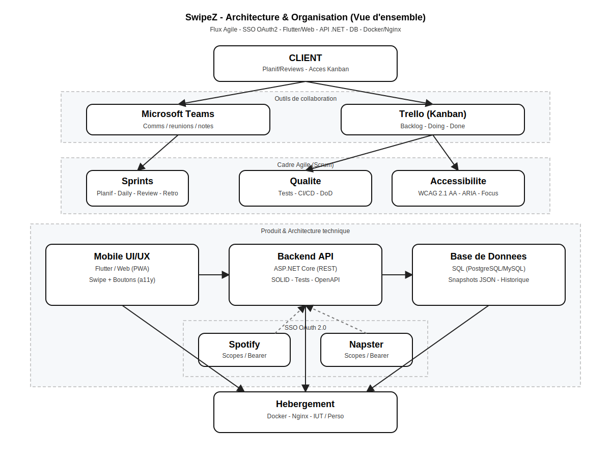

# 🎵 SwipeZ API

> API .NET 8 permettant d’authentifier un utilisateur via **Spotify OAuth2 PKCE**, de récupérer ses playlists, de gérer ses préférences et de stocker/cache les données utilisées par l’application mobile [SwipeZ](https://github.com/S5-C1-Exodia/mobile_app).

---

## 🚀 Introduction

SwipeZ est une application mobile qui simplifie la **gestion des playlists musicales** en offrant une expérience intuitive pour conserver ou supprimer des morceaux par un simple **swipe**.  
L’API que vous consultez ici fournit toutes les fonctionnalités serveur nécessaires à l’application : authentification sécurisée avec Spotify, récupération des playlists, gestion de sessions et cache.

- **API GitHub :** [https://github.com/S5-C1-Exodia/webservice](https://github.com/S5-C1-Exodia/webservice)  
- **Application mobile :** [https://github.com/S5-C1-Exodia/mobile_app](https://github.com/S5-C1-Exodia/mobile_app)

### 👥 Équipe

Martin LEMOIGNE • Maxime CHARLET • Guilhem BARRIQUAND • Mathis DE SOUSA • Victor LESUEUR • Maxence TEIXEIRA

---

## 🏗️ Architecture générale

### Schéma global



- L’application Flutter se connecte à Spotify pour authentifier l’utilisateur via **OAuth2 PKCE**.
- L’API reçoit les jetons, crée une **session sécurisée** et stocke les informations en base.
- Les playlists de l’utilisateur sont **mises en cache** pour réduire les appels à l’API Spotify.
- L’utilisateur peut ensuite **sélectionner, modifier ou vider ses préférences de playlists**.

### Modules principaux

- **Authentification PKCE OAuth2** : démarre l’autorisation Spotify, gère le retour `callback`, stocke refresh/access tokens.
- **Sessions & sécurité** : gestion du cycle de vie via `APPSESSION`, purge au logout, denylist des refresh tokens.
- **Gestion des playlists** : import par pages (`PLAYLISTCACHE`), lien session/cache (`PLAYLISTCACHE_SESSION`), sélection personnalisée (`PLAYLISTSELECTION`).
- **Logs & suivi** : `AUDITLOG` enregistre les actions clés pour audit et débogage.

---

## ⚙️ Installation & exécution locale

### Prérequis

- [.NET 8 SDK](https://dotnet.microsoft.com/en-us/download)
- [MySQL 8.4+](https://dev.mysql.com/downloads/mysql/)
- Visual Studio 2022 ou VS Code

### Cloner le projet

```bash
git clone https://github.com/S5-C1-Exodia/webservice.git
cd webservice/API
````

### Configuration

Renommer ou compléter `appsettings.json` à partir de `appsettings.Development.json` :

```jsonc
{
  "ConnectionStrings": {
    "Default": "Server=localhost;Port=3306;Database=swipezdb;Uid=root;Pwd=;"
  },
  "Spotify": {
    "ClientId": "<votre_client_id>",
    "RedirectUri": "https://<votre_ngrok_ou_domaine>/api/spotify/callback",
    "AuthorizeEndpoint": "https://accounts.spotify.com/authorize",
    "TokenEndpoint": "https://accounts.spotify.com/api/token",
    "BaseUrl": "https://api.spotify.com/v1",
    "PlaylistsPageSize": 50
  },
  "Deeplink": {
    "SchemeHost": "swipez://oauth-callback/spotify"
  },
  "Security": {
    "PkceTtlMinutes": 10,
    "SessionTtlMinutes": 60
  }
}
```

**Variables clés :**

| Clé                          | Description                                   |
| ---------------------------- | --------------------------------------------- |
| `ConnectionStrings.Default`  | Connexion MySQL                               |
| `Spotify.ClientId`           | Clé fournie par Spotify Developers            |
| `Spotify.RedirectUri`        | URL de callback OAuth Spotify                 |
| `Deeplink.SchemeHost`        | Lien profond pour ouvrir l’application mobile |
| `Security.PkceTtlMinutes`    | Durée de validité du challenge PKCE           |
| `Security.SessionTtlMinutes` | Durée de vie des sessions                     |

### Lancer l’API

```bash
dotnet restore
dotnet run
```

Par défaut l’API démarre sur `https://localhost:5001` (ou un port libre selon ta config).

---

## 🚀 Déploiement (structure)

> *(Section à compléter lors de la mise en production)*

* Reverse proxy (Caddy / Nginx)
* HTTPS (certificats Let’s Encrypt)
* Dockerfile / CI-CD (GitHub Actions, pipelines)
* Variables secrètes gérées via environnement
* Logs & monitoring (AuditLog)

---

## 🗄️ Base de données

L’API s’appuie sur MySQL 8.4 et la base `swipezdb`.

Chaque table et sa fonction sont décrites dans [🗄️ Base de données SwipeZ — Documentation rapide.md](./🗄️%20Base%20de%20données%20SwipeZ%20—%20Documentation%20rapide.md).

Résumé rapide :

* `APPSESSION` : sessions utilisateur
* `TOKENSET` : jetons OAuth long terme
* `ACCESSTOKEN` : jeton d’accès Spotify en cours
* `PLAYLISTCACHE` & `PLAYLISTCACHE_SESSION` : cache des playlists et lien par session
* `PLAYLISTSELECTION` : playlists choisies
* `USERPROFILECACHE` : profil utilisateur Spotify
* `PKCEENTRY` & `DENYLISTEDREFRESH` : sécurité OAuth
* `AUDITLOG` : traçabilité

---

## 🌐 Endpoints de l’API

### 1️⃣ Authentification

| Méthode | Endpoint                  | Description                                                                            |
| ------- | ------------------------- | -------------------------------------------------------------------------------------- |
| POST    | `/api/spotify/auth/start` | Démarre le flux OAuth2 PKCE et retourne l’URL Spotify + `state`.                       |
| GET     | `/api/spotify/callback`   | Callback Spotify : échange code ↔ tokens, création session, redirection vers deeplink. |
| POST    | `/api/spotify/logout`     | Déconnecte l’utilisateur et purge la session.                                          |

#### Exemple — Start Auth

```http
POST /api/spotify/auth/start
Content-Type: application/json

{
  "scopes": ["playlist-read-private", "playlist-modify-private"]
}
```

Réponse :

```json
{
  "authorizationUrl": "https://accounts.spotify.com/authorize?...",
  "state": "a1b2c3d4"
}
```

---

### 2️⃣ Playlists

| Méthode | Endpoint                                   | Description                                             |
| ------- | ------------------------------------------ | ------------------------------------------------------- |
| GET     | `/api/spotify/playlists`                   | Récupère les playlists (pagination via `X-Page-Token`). |
| GET     | `/api/spotify/playlist-preferences`        | Liste les playlists sélectionnées.                      |
| GET     | `/api/playlists/{playlist_id}/tracks`      | Liste les playlists sélectionnées.                      |
| PUT     | `/api/spotify/playlist-preferences`        | Remplace complètement la sélection de playlists.        |
| PATCH   | `/api/spotify/playlist-preferences/add`    | Ajoute des playlists à la sélection.                    |
| PATCH   | `/api/spotify/playlist-preferences/remove` | Retire des playlists de la sélection.                   |
| DELETE  | `/api/spotify/playlist-preferences`        | Supprime toutes les préférences.                        |

#### Exemple — Récupération playlists

```http
GET /api/spotify/playlists
X-Session-Id: 9c92a6e3-2ed1-41e3-bb64-5db26cfb5f3f
```

Réponse :

```json
{
  "items": [
    {
      "playlistId": "37i9dQZF1DXcBWIGoYBM5M",
      "name": "Today's Top Hits",
      "owner": { "displayName": "Spotify" },
      "images": [{ "url": "https://i.scdn.co/image/..." }],
      "tracksCount": 50
    }
  ],
  "nextPageToken": "abc123"
}
```

#### Exemple — Modifier préférences

```http
PUT /api/spotify/playlist-preferences
X-Session-Id: 9c92a6e3-2ed1-41e3-bb64-5db26cfb5f3f
Content-Type: application/json

{
  "playlistIds": ["37i9dQZF1DXcBWIGoYBM5M"]
}
```

Réponse : `204 No Content`

---

## 🔒 Sécurité

* **OAuth2 PKCE** : génération `code_verifier` & `code_challenge`, validation `state`, échange code → tokens.
* **Sessions** : créées à chaque callback, TTL configurable (60 min par défaut).
* **Refresh token denylist** : empêche la réutilisation après logout.
* **Audit & logs** : toutes les actions critiques sont inscrites dans `AUDITLOG`.
* **HTTPS recommandé** pour toute utilisation en production.

---

## ✅ Tests

* **Frameworks** : xUnit, Moq pour mocks.
* **Tests unitaires** : sur Helpers, Managers, Services.
* **Tests d’intégration** : scripts Python (connexion, déconnexion, playlists).
* Lancer les tests :

```bash
dotnet test
```

Pour les tests d’intégration Python :

```bash
cd Tests/Integration
pip install -r requirements.txt
python connexion.py
```

---

## 🤝 Contribution

* Forkez le repo puis créez une branche :
  `git checkout -b feature/ma-feature`
* Commit conventionnel (ex. `feat(auth): ajout d’un endpoint refresh token`)
* Pull request vers la branche `main`
* Tests à jour avant tout merge

---

## 📜 Licence

*(À insérer — ex. MIT adapté projet scolaire, ou mention IUT Dijon propriétaire pédagogique)*

---

## 🔎 Ressources utiles

* [Spotify Developer Dashboard](https://developer.spotify.com/dashboard/)
* [.NET 8 Documentation](https://learn.microsoft.com/en-us/dotnet/)
* [MySQL Documentation](https://dev.mysql.com/doc/)

